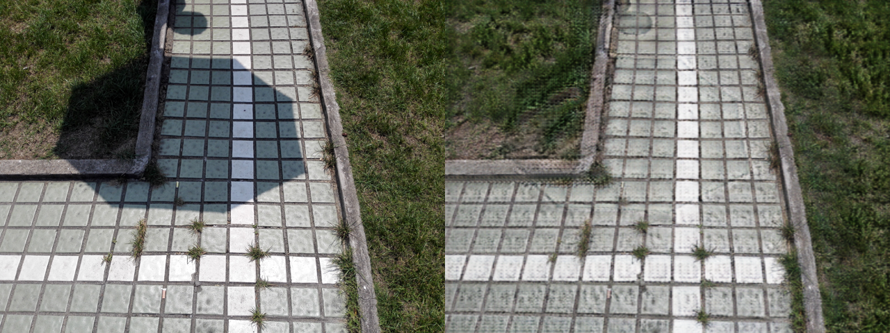
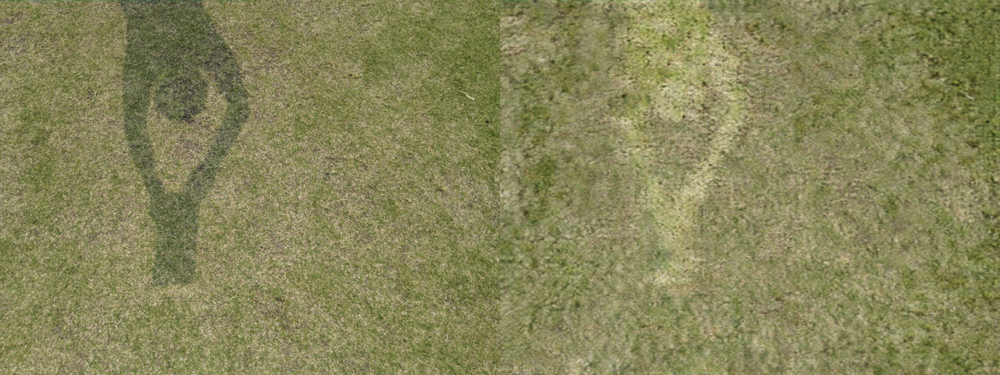
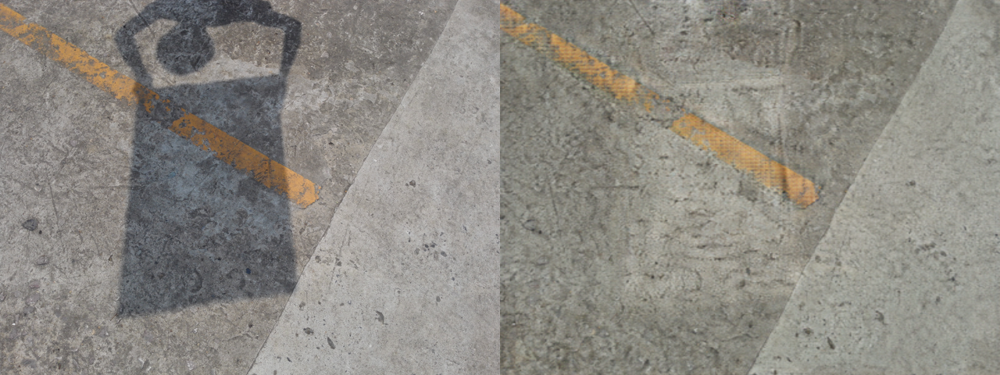
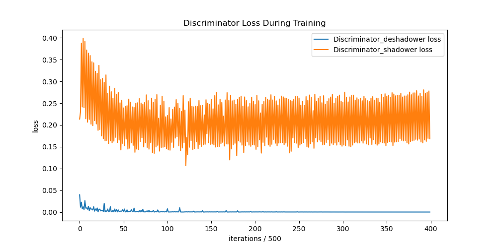

<center>

 Shadows correction with neural network
====

</center>

# About
Generative adversial neural network based on [CycleGAN](https://junyanz.github.io/CycleGAN/) architecture. This project was designed to  detect remove shadows area in images. Model was implemented in Pytorch and image processing with PIL library.

# Dataset 
[ISTD Dataset](https://paperswithcode.com/dataset/istd) consist of 1870 image triplets of shadow image,shadow mask and shadow-free image. Shadow mask images aren't used in that project. 

# Results
Due to hardware limitations of GPU VRAM gradient calculation for one generetors has been left out.
Below photos presents sample effects of working model for 200 epochs.

Input on the left, ouput on the right side.





Because of mentioned VRAM problem one of the losses funcions hasn''t been fixed.



# Development 
In root directory there is a .env template file containing dataset's root path.
Please fill lacking dataset folder before runnig the code. 
Please run following line in root project directory to avoid accidentaly pushing .env file 

```bash
git update-index --skip-worktree .env
```
# How to run 

Remember set dataset path in `.env` file.

Install dependencies by following command: 
```bash
 pip install -r requirements.txt
```

Run project by executing:
- train mode
```bash
pyhon src/main.py --train
```
- test mode
```bash
pyhon src/main.py --test
```
Above script use argparse library for setting up hyperparameters like batch size or number of epochs. Run it with `--help` parameter for more details.